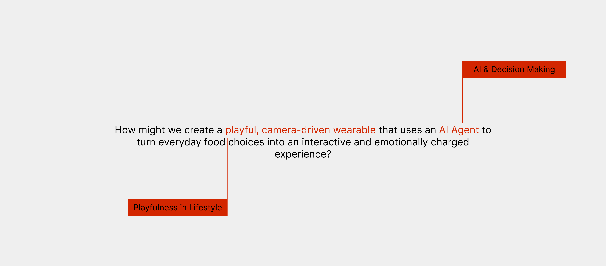

# 图片加载优化方案（除Lazy Loading外）

## 🎯 核心优化策略

### 1. **图片格式优化 - WebP/AVIF** ⭐⭐⭐⭐⭐
**效果**: 可减少 50-80% 文件大小

#### 实现方法：
```html
<!-- 使用 <picture> 标签提供多种格式 -->
<picture>
  <source srcset="Photo/LLM/main.webp" type="image/webp">
  <source srcset="Photo/LLM/main.avif" type="image/avif">
  
</picture>
```

#### 针对你的代码：
**LLM.html** - 首屏背景图优化：
```html
<!-- 替换第225行的背景图 -->
.landing-container {
    background: #000000;
    background-image: 
        image-set(
            url('Photo/LLM/main.webp') type('image/webp'),
            url('Photo/LLM/main.png') type('image/png')
        );
    background-size: cover;
    background-position: center;
}
```

**转换工具**:
- Squoosh (https://squoosh.app/) - 在线转换
- `cwebp` 命令行工具
- ImageMagick

---

### 2. **响应式图片 - srcset** ⭐⭐⭐⭐⭐
**效果**: 移动端加载小图，桌面端加载大图，节省带宽

#### 实现方法：
```html
<!-- 为不同屏幕尺寸提供不同大小的图片 -->

```

#### 针对你的代码：
**index.html** - 项目卡片优化：
```html
<!-- 替换 project1.png (18.67MB) -->
<div class="project-image">
    
</div>
```

---

### 3. **图片压缩** ⭐⭐⭐⭐⭐
**效果**: 减少 60-90% 文件大小，几乎不影响视觉质量

#### 压缩策略：
1. **PNG压缩**: 
   - TinyPNG (https://tinypng.com/)
   - ImageOptim (Mac)
   - pngquant 命令行

2. **JPEG压缩**:
   - 质量设置为 80-85%
   - 使用 mozjpeg 编码器

3. **批量压缩脚本**:
```bash
# 使用 ImageMagick 批量压缩
for file in Photo/**/*.png; do
    convert "$file" -quality 85 -strip "${file%.png}_compressed.png"
done
```

#### 目标大小：
- 首屏图片: < 300KB
- 内容图片: < 500KB
- Gallery图片: < 1MB

---

### 4. **模糊占位符 (Blur Placeholder)** ⭐⭐⭐⭐
**效果**: 立即显示低质量预览，提升感知性能

#### 实现方法：
```html
<!-- 使用低质量占位符 -->


<style>
.blur-load {
    filter: blur(10px);
    transition: filter 0.3s;
}
.blur-load.loaded {
    filter: blur(0);
}
</style>

<script>
// 加载完成后替换
document.querySelectorAll('.blur-load').forEach(img => {
    const fullImage = new Image();
    fullImage.src = img.dataset.src;
    fullImage.onload = () => {
        img.src = fullImage.src;
        img.classList.add('loaded');
    };
});
</script>
```

#### 生成占位符：
- 使用原图的 1/20 大小版本
- 或使用 Base64 编码的小图

---

### 5. **渐进式JPEG (Progressive JPEG)** ⭐⭐⭐
**效果**: 图片逐步显示，提升感知性能

#### 实现方法：
保存JPEG时选择"Progressive"选项：
- Photoshop: 保存为Web时选择"Progressive"
- ImageMagick: `convert input.jpg -interlace Plane output.jpg`

---

### 6. **预加载策略优化** ⭐⭐⭐⭐
**效果**: 只预加载关键资源，不阻塞首屏

#### 当前问题：
spotlight.html 预加载了9张图片，其中多张超过2MB

#### 优化方案：
```html
<!-- 只预加载首屏关键图片 -->
<link rel="preload" as="image" href="Photo/Spotlight/main.webp" fetchpriority="high">

<!-- 其他图片使用prefetch（低优先级） -->
<link rel="prefetch" as="image" href="Photo/Spotlight/eye1.webp">
<link rel="prefetch" as="image" href="Photo/Spotlight/eye2.webp">
```

#### 优先级规则：
- `fetchpriority="high"`: 仅首屏关键图片（1-2张）
- `preload`: 首屏可见但非关键
- `prefetch`: 可能需要的资源（低优先级）

---

### 7. **使用CSS背景图替代img标签** ⭐⭐⭐
**效果**: 某些场景下可以更好地控制加载

#### 适用场景：
- 装饰性图片
- 响应式背景图

#### 实现方法：
```css
/* 使用 image-set 提供多种格式 */
.hero-background {
    background-image: 
        image-set(
            url('Photo/LLM/main.webp') type('image/webp') 1x,
            url('Photo/LLM/main@2x.webp') type('image/webp') 2x,
            url('Photo/LLM/main.png') type('image/png') 1x
        );
    background-size: cover;
    background-position: center;
}

/* 媒体查询优化 */
@media (max-width: 768px) {
    .hero-background {
        background-image: url('Photo/LLM/main-mobile.webp');
    }
}
```

---

### 8. **图片尺寸优化** ⭐⭐⭐⭐⭐
**效果**: 只加载需要的尺寸，大幅减少文件大小

#### 问题分析：
- `project1.png` 18.67MB，但显示尺寸可能只有 400x300px
- 应该提供实际显示尺寸的图片

#### 实现方法：
```html
<!-- 根据实际显示尺寸提供图片 -->
<!-- 如果显示为 400x300，就提供 400x300 的图片，而不是原始大图 -->

```

#### 工具：
- 使用 Photoshop/GIMP 调整尺寸
- 或使用脚本批量调整：
```python
from PIL import Image
import os

def resize_images(input_dir, max_width=1920, quality=85):
    for root, dirs, files in os.walk(input_dir):
        for file in files:
            if file.lower().endswith(('.png', '.jpg', '.jpeg')):
                path = os.path.join(root, file)
                img = Image.open(path)
                if img.width > max_width:
                    ratio = max_width / img.width
                    new_size = (max_width, int(img.height * ratio))
                    img = img.resize(new_size, Image.Resampling.LANCZOS)
                    img.save(path, optimize=True, quality=quality)
```

---

### 9. **使用CDN和HTTP/2 Server Push** ⭐⭐⭐
**效果**: 加速资源加载

#### 实现方法：
```html
<!-- 使用CDN -->
<link rel="dns-prefetch" href="https://cdn.example.com">
<link rel="preconnect" href="https://cdn.example.com" crossorigin>


```

---

### 10. **Intersection Observer优化** ⭐⭐⭐⭐
**效果**: 更精确的懒加载控制

#### 实现方法：
```javascript
// 更精确的懒加载实现
const imageObserver = new IntersectionObserver((entries, observer) => {
    entries.forEach(entry => {
        if (entry.isIntersecting) {
            const img = entry.target;
            const src = img.dataset.src;
            
            // 创建新图片对象预加载
            const imageLoader = new Image();
            imageLoader.src = src;
            imageLoader.onload = () => {
                img.src = src;
                img.classList.add('loaded');
            };
            
            observer.unobserve(img);
        }
    });
}, {
    rootMargin: '50px', // 提前50px开始加载
    threshold: 0.01
});

// 观察所有需要懒加载的图片
document.querySelectorAll('img[data-src]').forEach(img => {
    imageObserver.observe(img);
});
```

---

### 11. **使用现代图片格式 - AVIF** ⭐⭐⭐⭐
**效果**: 比WebP更小，质量更好

#### 实现方法：
```html
<picture>
    <source srcset="Photo/LLM/main.avif" type="image/avif">
    <source srcset="Photo/LLM/main.webp" type="image/webp">
    
</picture>
```

#### 浏览器支持：
- Chrome 85+
- Firefox 93+
- Safari 16+

---

### 12. **图片Sprites（小图标）** ⭐⭐
**效果**: 减少HTTP请求

#### 适用场景：
- 小图标
- 重复使用的装饰元素

---

## 📋 针对你的代码的具体优化建议

### LLM.html 优化示例：

**当前代码**（第101-102行）：
```html


```

**优化后**：
```html
<picture>
    <source srcset="Photo/LLM/LLM1.webp" type="image/webp">
    
</picture>
<picture>
    <source srcset="Photo/LLM/LLM2.webp" type="image/webp">
    
</picture>
```

### index.html 项目卡片优化：

**当前代码**（第123行）：
```html

```

**优化后**：
```html
<picture>
    <source 
        media="(max-width: 768px)"
        srcset="project1-mobile.webp 480w, project1-mobile@2x.webp 960w"
        type="image/webp"
    >
    <source 
        srcset="project1.webp 1200w, project1@2x.webp 2400w"
        type="image/webp"
    >
    
</picture>
```

### spotlight.html 预加载优化：

**当前代码**（第9-22行）：
```html
<link rel="preload" as="image" href="Photo/Spotlight/main.png">
<link rel="preload" as="image" href="Photo/Spotlight/logo.png">
<!-- ... 还有7张图片 -->
```

**优化后**：
```html
<!-- 只预加载首屏关键图片 -->
<link rel="preload" as="image" href="Photo/Spotlight/main.webp" fetchpriority="high">

<!-- 其他使用prefetch（低优先级） -->
<link rel="prefetch" as="image" href="Photo/Spotlight/logo.webp">
<link rel="prefetch" as="image" href="Photo/Spotlight/code.webp">
<!-- ... -->
```

---

## 🛠️ 实施步骤

### 第一步：图片压缩和格式转换
1. 使用 TinyPNG 或 Squoosh 压缩所有图片
2. 转换为 WebP 格式
3. 生成响应式尺寸版本

### 第二步：代码优化
1. 添加 `<picture>` 标签
2. 添加 `loading="lazy"`
3. 优化预加载策略

### 第三步：测试
1. 使用 Chrome DevTools Network 面板测试
2. 使用 Lighthouse 测试性能
3. 在不同设备上测试

---

## 📊 预期效果

| 优化方法 | 文件大小减少 | 加载时间减少 |
|---------|------------|------------|
| WebP格式 | 50-80% | 50-80% |
| 图片压缩 | 60-90% | 60-90% |
| 响应式图片 | 40-70% (移动端) | 40-70% |
| 尺寸优化 | 70-95% | 70-95% |
| **综合优化** | **80-95%** | **80-95%** |

---

## 🎯 优先级建议

1. **立即执行**:
   - 压缩超大图片（>5MB）
   - 转换为WebP格式
   - 添加lazy loading

2. **尽快执行**:
   - 实现响应式图片
   - 优化预加载策略
   - 添加模糊占位符

3. **后续优化**:
   - 使用AVIF格式
   - 实现Intersection Observer
   - 使用CDN

